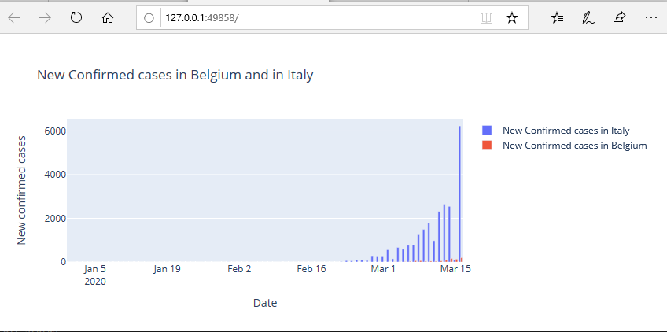
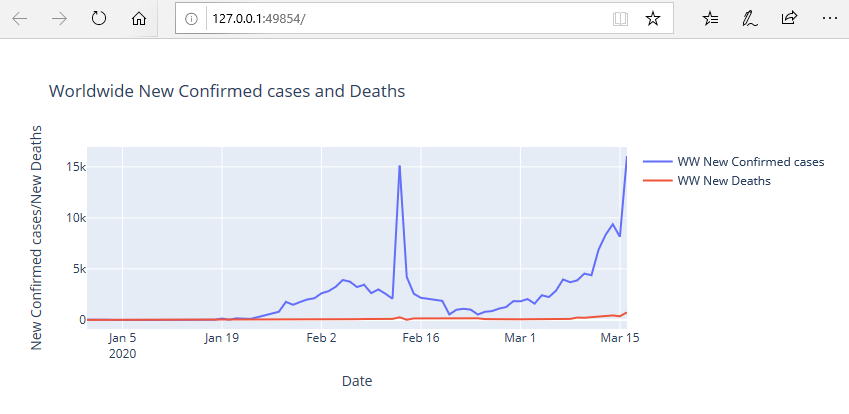
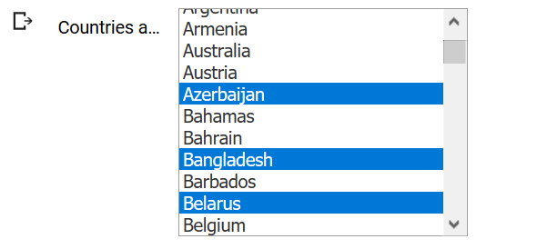

# covid-19

Jupyter notebeook built to digest, compile and analyze data related to the covid-19

The charts are displayed using plotly <https://plot.ly>

Run the jupyter 

* on Google Colab : 

* on Azure Notebooks : <https://notebooks.azure.com/abdelkrim/projects/covid-19>

Author : Abdelkrim Boujraf working for <http://www.alt-f1.be>

# how to run the code using python3?

* download the code on your machine
* install python3
* run `pip install -r requirements.txt`
* run the code `python daily_geographic_distribution_of_covid_19_cases_worldwide.py`

## results in the browser

* your default browser will start and display three charts

### Covid-19 - New confirmed cases in Belgium and Italy

### Covid-19 - New deaths in Belgium and Italy

### Covid-19 - Worldwide, new confirmed cases and new deaths

# how to run the code on a jupyter notebook

upload the jupyter notebook on Google Colab <https://colab.research.google.com/>

The jupyter notebook runs exactly the same code as the python code.

The user chooses the countries s.he wants to compare by using the 'Select multiple' widget

# license

The GNU Affero General Public License is a modified version of the ordinary GNU GPL version 3. It has one added requirement: if you run a modified program on a server and let other users communicate with it there, your server must also allow them to download the source code corresponding to the modified version running there.

* why affero? https://www.gnu.org/licenses/why-affero-gpl.html

* source: https://www.gnu.org/licenses/agpl-3.0.en.html
